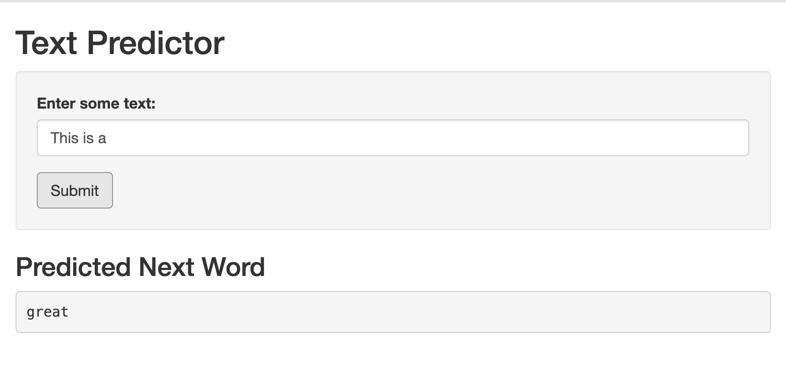

```{r setup, include=FALSE}
knitr::opts_chunk$set(echo = FALSE)
```

## Overview

"Text Predictor" is a Shiny app that accepts a phrase composed of multiple words as input and outputs a prediction of the next word.

## Model Description

The model was generated using data from the `en_US.blogs.txt`, `en_US.news.txt`, and `en_US.twitter.txt` files found in the [Coursera-Swiftkey Dataset](https://d396qusza40orc.cloudfront.net/dsscapstone/dataset/Coursera-SwiftKey.zip).

`150000` lines from each file were read into a corpus which was then tokenized into bi-, tri-, and fourgrams. This tokenization procedure takes care of whitespaces and punctuation. Something that wasn't explored was the removal of digits and stop words, as well as the lemmatization of the text. Once tokenized, a data frame is created with n+1 columns where columns 1 through n represent a sequence of words with a frequency denoted in column n. For example, this is what the top 6 entries look like in the bigram counts dataframe:

```{r load_bigrams, echo=FALSE}
bigrams <- readRDS('./data/bigrams.rds')
head(bigrams)
```

## Model Prediction
When predicting the next word, we employ the "backoff" technique. This is where we grab the greatest n-1 last words in the input text and if we fail to return a match, then the first word is dropped and a smaller n-gram is used.

For example, if the input text is `This is a` and the fourgram dataframe has zero entries with this sequence of words then we "backoff" and attempt to predict with a trigram with `is a` as the input.

## Example
Sample image of Text Predictor app
``` {r echo=FALSE}

```